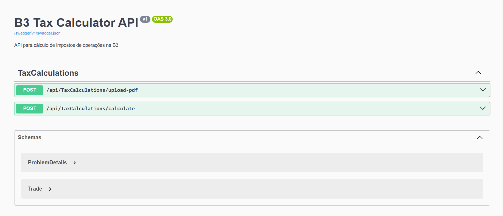

# B3TaxCalculator API

[](https://dotnet.microsoft.com/download)
[](../LICENSE)
[](https://github.com/jonlopesmoreira/B3TaxCalculator)

API REST para cálculo de impostos sobre operações de trading na B3.

> 💡 **Aceita PDFs de notas de corretagem ou dados estruturados em JSON**

> 📌 **Parte do projeto [B3TaxCalculator](../README.md)** - Veja a documentação principal para mais contexto

## 📑 Índice

- [Pré-requisitos](#-pré-requisitos)
- [Instalação](#-instalação)
- [Uso Rápido](#-uso-rápido)
- [Endpoints](#-endpoints)
- [Modelo de Dados](#-modelo-de-dados)
- [Exemplos Completos](#-exemplos-completos)
- [Troubleshooting](#-troubleshooting)
- [Roadmap](#-roadmap)
- [Contribuindo](#-contribuindo)

---

## ✅ Pré-requisitos

- **.NET 10** ou superior ([Download](https://dotnet.microsoft.com/download/dotnet/10.0))
- **Git** (opcional, apenas se clonar do GitHub)
- **Postman** ou **curl** (para testar a API)

Verifique a instalação:
```bash
dotnet --version
```

---

## 🔧 Instalação

### 1. Clone o repositório
```bash
git clone https://github.com/jonlopesmoreira/B3TaxCalculator.git
cd B3TaxCalculator
```

### 2. Restaure as dependências
```bash
dotnet restore
```

### 3. Compile o projeto
```bash
dotnet build
```

---

## 🚀 Uso Rápido

### 1. Iniciar a API

```bash
cd B3TaxCalculator.API
dotnet run
```

> 📍 A API estará disponível em:
> - **HTTP**: `http://localhost:5187`
> - **HTTPS**: `https://localhost:7031`

### 2. Acessar a Documentação Swagger

Abra no navegador:
```
http://localhost:5187/swagger/index.html
```

Você verá a interface interativa com todos os endpoints:



---

## 📡 Endpoints

### **POST `/api/tax-calculations/upload-pdf`** 📄

Calcula impostos a partir de um ou múltiplos PDFs de notas de operação da B3.

**Quando usar:** Você tem PDFs de notas de corretagem da B3 e quer que a API extraia os dados automaticamente.

#### Request - PDF Único
```bash
curl -X POST http://localhost:5187/api/tax-calculations/upload-pdf \
  -F "files=@nota_janeiro.pdf"
```

#### Request - Múltiplos PDFs
```bash
curl -X POST http://localhost:5187/api/tax-calculations/upload-pdf \
  -F "files=@nota_janeiro.pdf" \
  -F "files=@nota_fevereiro.pdf"
```

#### Response (Sucesso - 200)
```json
{
  "id": "550e8400-e29b-41d4-a716-446655440000",
  "success": true,
  "filesProcessed": ["nota_janeiro.pdf"],
  "totalFilesRequested": 1,
  "totalTradesFound": 24,
  "totalValidTrades": 23,
  "exerciseTrades": [
    {
      "date": "2026-01-15T00:00:00",
      "asset": "PETR4",
      "side": "C",
      "quantity": 100,
      "price": 25.50,
      "total": 2550.00,
      "reduction": 10.50,
      "note": "Exercício de Opção - reduz imposto"
    }
  ],
  "totalTaxToPayThisMonth": 150.75,
  "monthlyResults": [
    {
      "year": 2026,
      "month": 1,
      "stockTotalBuy": 5000.00,
      "stockTotalSell": 4500.00,
      "stockTax": 45.00,
      "optionProfit": 150.00,
      "optionTax": 22.50
    }
  ]
}
```

#### Response (Erro - 400)
```json
{
  "success": false,
  "message": "Nenhum arquivo PDF fornecido"
}
```

---

### **POST `/api/tax-calculations/calculate`** 📊

Calcula impostos a partir de uma lista de operações em JSON.

**Quando usar:** Você já tem os dados estruturados (API terceira, banco de dados, etc.) e não precisa parsear PDF.

#### Request
```bash
curl -X POST http://localhost:5187/api/tax-calculations/calculate \
  -H "Content-Type: application/json" \
  -d '[
    {
      "date": "2026-01-15T00:00:00",
      "asset": "PETR4",
      "market": "VISTA",
      "side": "C",
      "quantity": 100,
      "price": 25.50,
      "fees": 10.50,
      "isExercise": false,
      "notaNumber": "123456"
    },
    {
      "date": "2026-01-20T00:00:00",
      "asset": "PETR4",
      "market": "VISTA",
      "side": "V",
      "quantity": 50,
      "price": 26.00,
      "fees": 8.00,
      "isExercise": false,
      "notaNumber": "123457"
    }
  ]'
```

#### Response (Sucesso - 200)
```json
{
  "id": "550e8400-e29b-41d4-a716-446655440000",
  "success": true,
  "tradesProcessed": 2,
  "validTrades": 2,
  "exerciseTrades": [],
  "totalTaxToPayThisMonth": 22.50,
  "monthlyResults": [
    {
      "year": 2026,
      "month": 1,
      "stockTotalBuy": 2550.00,
      "stockTotalSell": 1300.00,
      "stockProfit": 250.00,
      "stockTax": 22.50
    }
  ]
}
```

---

## 📝 Modelo de Dados

### Trade (Operação)

| Campo | Tipo | Obrigatório | Descrição |
|-------|------|:-----------:|-----------|
| `date` | DateTime | ✅ | Data da operação (ISO 8601: `2026-01-15T00:00:00`) |
| `asset` | string | ✅ | Código do ativo (ex: `PETR4`, `VALE3`, `CMINO540`) |
| `market` | string | ✅ | Tipo de mercado (`VISTA`, `FUTURO`, `OPCAO_COMPRA`, `OPCAO_VENDA`) |
| `side` | string | ✅ | Lado: `"C"` (Compra) ou `"V"` (Venda) |
| `quantity` | int | ✅ | Quantidade de ações/contratos |
| `price` | decimal | ✅ | Preço unitário |
| `fees` | decimal | ✅ | Taxas/corretagem |
| `isExercise` | boolean | ❌ | Exercício de opção (padrão: `false`) |
| `notaNumber` | string | ❌ | Número da nota de corretagem |

---

## 🎯 Exemplos Completos

### Exemplo 1: Operação de Compra e Venda de Ação

```json
[
  {
    "date": "2026-01-15T00:00:00",
    "asset": "PETR4",
    "market": "VISTA",
    "side": "C",
    "quantity": 100,
    "price": 25.50,
    "fees": 10.00,
    "isExercise": false,
    "notaNumber": "123456"
  },
  {
    "date": "2026-01-25T00:00:00",
    "asset": "PETR4",
    "market": "VISTA",
    "side": "V",
    "quantity": 100,
    "price": 26.00,
    "fees": 10.00,
    "isExercise": false,
    "notaNumber": "123457"
  }
]
```

**Resultado esperado:**
- Custo total de compra: R$ 2.550,00 + R$ 10,00 = R$ 2.560,00
- Receita de venda: R$ 2.600,00 - R$ 10,00 = R$ 2.590,00
- **Lucro: R$ 30,00**
- **Imposto (15%): R$ 4,50**

---

### Exemplo 2: Operações com Opções

```json
[
  {
    "date": "2026-01-15T00:00:00",
    "asset": "CMINO540",
    "market": "OPCAO_VENDA",
    "side": "V",
    "quantity": 100,
    "price": 0.14,
    "fees": 0.02,
    "isExercise": false,
    "notaNumber": "123456"
  },
  {
    "date": "2026-01-20T00:00:00",
    "asset": "CMINO540",
    "market": "OPCAO_VENDA",
    "side": "C",
    "quantity": 100,
    "price": 0.10,
    "fees": 0.01,
    "isExercise": false,
    "notaNumber": "123457"
  }
]
```

---

## 🔧 Troubleshooting

### ❌ Erro: "Unable to start program"

**Solução:**
```bash
# Limpe e rebuild
dotnet clean
dotnet build
```

### ❌ Erro: "Port 5187 already in use"

**Solução:**
```bash
# Encontre o processo
Get-NetTCPConnection -LocalPort 5187 -ErrorAction SilentlyContinue

# Ou use outra porta
dotnet run --urls "http://localhost:5188"
```

### ❌ PDF não é reconhecido

**Solução:**
- Verifique se o PDF é de uma corretora B3 suportada
- O arquivo deve estar em formato texto (PDF searchable)
- PDFs digitalizados (imagem) não são suportados

### ❌ CORS Error

**Solução:** A API já tem CORS habilitado para todas as origens. Verifique o `Program.cs`:
```csharp
options.AllowAnyOrigin()
       .AllowAnyMethod()
       .AllowAnyHeader();
```

---

## 🛠️ Tecnologias

| Tecnologia | Versão | Propósito |
|-----------|--------|----------|
| **.NET** | 10 | Framework principal |
| **ASP.NET Core** | 10 | Framework web |
| **Swashbuckle** | 6.8.1 | Documentação Swagger |
| **iText7** | - | Leitura de PDFs |
| **C#** | 13 | Linguagem |

---

## 🚧 Roadmap

- [ ] Suporte para mais corretoras B3
- [ ] Cache de cálculos
- [ ] Autenticação/Autorização
- [ ] Limite de rate limiting
- [ ] Exportar relatórios em Excel
- [ ] WebSocket para cálculos em tempo real
- [ ] Integração com DARF automático

---

## 🤝 Contribuindo

Contribuições são bem-vindas! Para contribuir:

1. **Fork** o repositório
2. **Crie uma branch** para sua feature (`git checkout -b feature/AmazingFeature`)
3. **Commit** suas mudanças (`git commit -m 'Add AmazingFeature'`)
4. **Push** para a branch (`git push origin feature/AmazingFeature`)
5. **Abra um Pull Request**

### Diretrizes de Contribuição

- Siga o padrão C# existente
- Adicione testes para novas funcionalidades
- Atualize o README se necessário
- Escreva commits claros e descritivos

---

## 📄 Licença

Este projeto está licenciado sob a Licença MIT - veja o arquivo [LICENSE](../LICENSE) para detalhes.

```
    "XPINC_NOTA_NEGOCIACAO_B3_25_2_2026.pdf",
    "XPINC_NOTA_NEGOCIACAO_B3_3_2026.pdf"
  ],
  "totalFilesRequested": 2,
  "totalTradesFound": 48,
  "totalValidTrades": 46,
  "monthlyResults": [...]
}
```

---

### **3. POST /api/taxcalculation/calculate-trades**

Calcula impostos a partir de uma lista JSON de operações (sem necessidade de PDF).

**Request:**
```json
POST /api/taxcalculation/calculate-trades HTTP/1.1
Content-Type: application/json

[
  {
    "date": "2026-02-25",
    "asset": "CMINO540",
    "market": "OPCAO_VENDA",
    "side": "V",
    "quantity": 100,
    "price": 0.14,
    "fees": 0.02,
    "notaNumber": "12345"
  },
  {
    "date": "2026-02-25",
    "asset": "CMINO540",
    "market": "OPCAO_VENDA",
    "side": "C",
    "quantity": 100,
    "price": 0.17,
    "fees": 0.01,
    "notaNumber": "12345"
  }
]
```

**Response (Success - 200):**
```json
{
  "success": true,
  "tradesProcessed": 2,
  "validTrades": 2,
  "monthlyResults": [...]
}
```

---

## 🔧 Exemplos com cURL

### Processar um PDF:
```bash
curl -X POST "https://localhost:5001/api/taxcalculation/process-pdf" \
  -F "file=@nota.pdf"
```

### Processar múltiplos PDFs:
```bash
curl -X POST "https://localhost:5001/api/taxcalculation/process-pdfs" \
  -F "files=@nota1.pdf" \
  -F "files=@nota2.pdf" \
  -F "files=@nota3.pdf"
```

### Calcular operações via JSON:
```bash
curl -X POST "https://localhost:5001/api/taxcalculation/calculate-trades" \
  -H "Content-Type: application/json" \
  -d '[
    {
      "date": "2026-02-25",
      "asset": "CMINO540",
      "market": "OPCAO_VENDA",
      "side": "V",
      "quantity": 100,
      "price": 0.14,
      "fees": 0.02,
      "notaNumber": "12345"
    }
  ]'
```

---

## 🛠️ Exemplos com Postman

1. **Criar nova requisição POST**
2. **URL:** `https://localhost:5001/api/taxcalculation/process-pdf`
3. **Tab "Body":**
   - Selecionar **form-data**
   - Key: `file`
   - Type: **File**
   - Selecionar arquivo PDF
4. **Enviar (Send)**

---

## 📊 Estrutura da Resposta MonthlyResult

```json
{
  "year": 2026,
  "month": 2,

  "priorMonthTaxCarryover": 0.00,
  "taxCarryoverToNextMonth": 5.83,
  "taxToPayThisMonth": 0.00,

  "stockTotalBuy": 354.14,
  "stockTotalSell": 0.00,
  "stockTotalFees": 0.16,
  "stockProfit": 0,
  "stockLoss": 0,
  "stockAccumulatedLoss": 0,
  "stockTaxableProfit": 0,
  "stockTax": 0,
  "stockIsExempt": true,
  "stockDescription": "Isento - vendas (R$ 0,00) abaixo de R$ 20.000,00",

  "optionTotalBuy": 39.03,
  "optionTotalSell": 77.89,
  "optionTotalFees": 88.28,
  "optionCompensatingBuyTotal": 39.03,
  "optionGrossSell": 77.89,
  "optionNetProfit": 32.85,
  "optionProfit": 38.86,
  "optionLoss": 0,
  "optionAccumulatedLoss": 0,
  "optionTaxableProfit": 38.86,
  "optionTax": 5.83,
  "optionDescription": "DARF: R$ 5,83 (15% sobre lucro de R$ 38,86)",
  "optionCompensatingTrades": ["25/02: COMPRA CMINO540 100x @ 0,17 = R$ 39,03"],
  "optionAuditEntries": [
    {
      "date": "2026-02-20",
      "asset": "CMINO540",
      "side": "V",
      "grossValue": 24.00,
      "netValueImpact": 1.97,
      "fees": 22.03,
      "accumulatedNetValue": 1.97,
      "price": 0.24,
      "quantity": 100
    }
  ],

  "totalTax": 5.83
}
```

---

## 🔐 CORS (Cross-Origin Resource Sharing)

A API está configurada com CORS permissivo para desenvolvimento:

```csharp
policy.AllowAnyOrigin()
      .AllowAnyMethod()
      .AllowAnyHeader();
```

**Para produção**, configure CORS restritivo:

```csharp
policy.WithOrigins("https://seudominio.com")
      .AllowAnyMethod()
      .AllowAnyHeader();
```

---

## 🐛 Tratamento de Erros

### Requisição Inválida (400)
```json
{
  "success": false,
  "message": "Arquivo PDF é obrigatório",
  "error": null
}
```

### Erro de Processamento (500)
```json
{
  "success": false,
  "message": "Erro ao processar PDF",
  "error": "Exception details here..."
}
```

---

## 📦 Dependências

- **ASP.NET Core 10.0**
- **Swashbuckle.AspNetCore 6.10.0** (Swagger/OpenAPI)
- **UglyToad.PdfPig** (Parser PDF)

---

## 🚢 Deploy

### Docker (Exemplo)

```dockerfile
FROM mcr.microsoft.com/dotnet/sdk:10.0 AS build
WORKDIR /src
COPY . .
RUN dotnet publish -c Release -o /app

FROM mcr.microsoft.com/dotnet/aspnet:10.0
WORKDIR /app
COPY --from=build /app .
EXPOSE 80
ENTRYPOINT ["dotnet", "B3TaxCalculator.API.dll"]
```

### Executar Docker:
```bash
docker build -t b3taxcalculator-api .
docker run -p 8080:80 b3taxcalculator-api
```

---

## 📝 Notas

- Arquivos PDF são carregados em `Path.GetTempPath()` e deletados após processamento
- Máximo de arquivos simultâneos: Limitado pela memória disponível
- Suporta operações de exercício de opção (marcadas com flag `isExercise`)
- Cálculos de impostos: 15% para opções, isenção para ações com vendas < R$ 20.000

---

## 🤝 Contribuindo

Para contribuir, faça fork do repositório e crie uma branch com sua feature.

---

## 📄 Licença

MIT License
