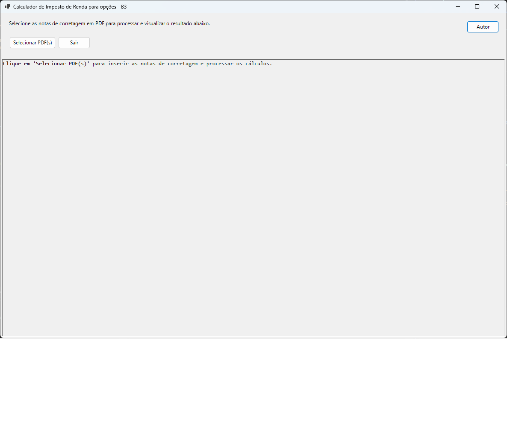
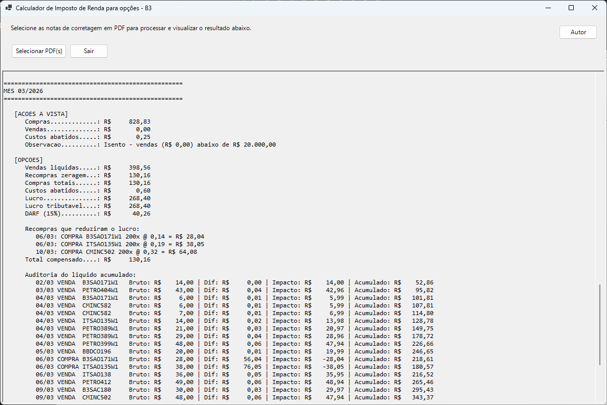

# B3TaxCalculator

[](https://dotnet.microsoft.com/)
[](https://learn.microsoft.com/dotnet/desktop/winforms/)
[](LICENSE)
[](https://github.com/jonlopesmoreira/B3TaxCalculator)

Aplicativo desktop em **Windows Forms (.NET 10)** para leitura de **notas de corretagem em PDF** e geração de um **resumo mensal de apuração de imposto** para operações da **B3**.

Projeto focado em **automação de processamento de documentos financeiros**, **extração de dados a partir de PDFs** e **consolidação de regras de cálculo tributário** em uma aplicação desktop simples e objetiva.

## Visão geral

O objetivo do projeto é facilitar a conferência de operações e a apuração mensal, consolidando compras, vendas, custos e compensações em uma interface simples.

O projeto oferece duas formas de acesso:
- **Interface Desktop**: aplicação Windows Forms para uso interativo
- **API REST**: endpoints para integração com outras aplicações

Além do uso prático, este repositório também demonstra experiência com:

- desenvolvimento de aplicações desktop em .NET
- criação de APIs REST com ASP.NET Core
- modelagem de regras de negócio
- parsing de texto extraído de PDF
- organização de código em camadas simples de UI, modelos e serviços
- publicação de aplicação Windows em modo `self-contained` e arquivo único

### Funcionalidades

#### Desktop
- importação de uma ou mais notas de corretagem em PDF
- extração automática das operações encontradas no documento
- separação e consolidação por mês
- cálculo para:
  - ações à vista
  - opções
- rateio de custos por nota
- exibição de lucro, prejuízo, compensações e DARF
- aplicação de saldo acumulado e valor mínimo para pagamento
- auditoria textual do resultado líquido acumulado para opções
- identificação de exercícios de opção e seu impacto na redução de impostos

#### API REST
- processamento de um ou múltiplos PDFs via upload
- cálculo direto a partir de lista JSON de operações
- resposta estruturada com detalhamento mensal
- documentação interativa via Swagger
- informações sobre operações de exercício de opção

## Tecnologias

- **.NET 10**
- **Windows Forms**
- **PdfPig** para leitura e extração de texto dos PDFs

## Destaques técnicos

- interface desktop construída com **Windows Forms**
- leitura de documentos PDF com preservação de linhas para melhorar o parsing
- uso de **expressões regulares** para identificar notas, ativos e operações
- rateio proporcional de custos por nota de corretagem
- cálculo separado para **ações à vista** e **opções**
- controle de **prejuízo acumulado**, **lucro tributável** e **saldo mínimo de DARF**
- geração de saída textual detalhada para conferência manual

## Requisitos

- Windows
- .NET 10 SDK para executar via código-fonte

> Na versão publicada como `self-contained`, o runtime do .NET não precisa estar instalado na máquina de destino.

## Como usar

### Interface Desktop

1. Abra o programa.
2. Clique em **Selecionar PDF(s)**.
3. Escolha uma ou mais notas de corretagem.
4. Aguarde o processamento.
5. Analise o resumo mensal exibido na tela.

### API REST

#### API REST

Para usar a API REST em produção ou integração com outras aplicações:

**📚 [Documentação Completa da API →](./B3TaxCalculator.API/README.md)**

A documentação detalhada inclui:
- ✅ Guia de instalação
- ✅ Exemplos com curl, PowerShell e Postman
- ✅ Modelos de dados completos
- ✅ Troubleshooting e FAQs
- ✅ Roadmap de funcionalidades

**Início rápido:**

```powershell
dotnet run --project .\B3TaxCalculator.API\B3TaxCalculator.API.csproj
```

Depois acesse: `http://localhost:5187/swagger/index.html`

#### Endpoints Principais

| Endpoint | Método | Descrição |
|----------|--------|-----------|
| `/api/tax-calculations/upload-pdf` | POST | Upload de PDF(s) da B3 |
| `/api/tax-calculations/calculate` | POST | Cálculo direto de JSON |

Veja a [documentação da API](./B3TaxCalculator.API/README.md) para exemplos completos.

## O que é exibido no resultado

O aplicativo mostra, entre outros dados:

- operações encontradas por data
- total de compras e vendas
- custos rateados
- lucro ou prejuízo do período
- prejuízo acumulado
- lucro tributável
- DARF devido
- saldo transportado para o mês seguinte
- exercícios de opção com valor de redução de imposto
- auditoria detalhada do acumulado mensal (sem considerar meses anteriores)

## Caso de uso

Esse projeto é útil para investidores que desejam:

- consolidar várias notas de corretagem rapidamente
- conferir operações por mês
- entender o impacto de custos e recompras no resultado
- visualizar uma memória de cálculo antes do preenchimento manual das obrigações fiscais

## Screenshots

### Tela principal



### Resumo mensal



## Executar localmente

### Desktop

Na raiz do repositório:

```powershell
dotnet run --project .\B3TaxCalculator\B3TaxCalculator.csproj
```

### API

Na raiz do repositório:

```powershell
dotnet run --project .\B3TaxCalculator.API\B3TaxCalculator.API.csproj
```

Acesse `http://localhost:5187` para visualizar a documentação Swagger.

### API + Desktop (simultaneamente)

Use a opção **"Multiple startup projects"** do Visual Studio conforme descrito na seção [Como usar - Rodar API e Desktop simultaneamente](#rodar-api-e-desktop-simultaneamente).

## Publicar executável

Para gerar uma versão `Release`, `win-x64`, `self-contained` e em arquivo único:

```powershell
dotnet publish .\B3TaxCalculator\B3TaxCalculator.csproj -c Release -r win-x64 --self-contained true /p:PublishSingleFile=true /p:IncludeNativeLibrariesForSelfExtract=true
```

Saída esperada:

```text
B3TaxCalculator\bin\Release\net10.0-windows\win-x64\publish\
```

> O asset publicado no release `v1.0.0` é uma build **framework-dependent** para `win-x64` e requer o **.NET 10 Desktop Runtime** instalado no Windows.

## Estrutura do projeto

```text
B3TaxCalculator/
├── B3TaxCalculator/                      # Desktop (Windows Forms)
│   ├── MainForm.cs
│   ├── Program.cs
│   ├── Models/
│   │   ├── NotaCosts.cs
│   │   ├── OptionAuditEntry.cs
│   │   ├── PdfReadResult.cs
│   │   └── Trade.cs
│   └── Services/
│       ├── PdfReader.cs
│       ├── TaxCalculator.cs
│       └── TradeParser.cs
│
├── B3TaxCalculator.API/                  # API REST (ASP.NET Core)
│   ├── Controllers/
│   │   └── TaxCalculationController.cs
│   ├── Converters/
│   │   └── RoundedDecimalConverter.cs
│   ├── Models/
│   │   └── TaxCalculationRequest.cs
│   └── Program.cs
│
├── B3TaxCalculator.Core/                 # Modelos compartilhados
│   └── Models/
│
└── B3TaxCalculator.Tests/                # Testes unitários (xUnit)
    └── Services/
        └── TaxCalculatorTests.cs
```

## Observações

- a extração depende do layout textual do PDF
- o parser foi ajustado para o formato de notas atualmente tratado pelo projeto
- em builds `Release`, a pasta `DebugPdf` não é gerada
- alterações no layout da corretora podem exigir ajustes nas expressões regulares e no parser

## Roadmap

- [x] leitura de PDFs
- [x] cálculo para ações à vista
- [x] cálculo para opções
- [x] API REST com 3 endpoints
- [x] documentação via Swagger
- [x] identificação de exercícios de opção
- [x] auditoria com acumulado por mês
- [x] publicação `self-contained` em arquivo único
- [x] testes unitários com xUnit
- [ ] suporte a mais layouts de nota
- [ ] exportação do resultado para arquivo
- [ ] melhorias de usabilidade da interface
- [ ] autenticação na API

## Portfólio

Este projeto pode ser apresentado como exemplo de:

- aplicação desktop com foco em produtividade
- API REST com documentação Swagger
- automação de tarefa financeira recorrente
- transformação de documento semiestruturado em informação útil
- implementação de regra de negócio com rastreabilidade no resultado final
- integração de duas interfaces (desktop + web service)
- testes unitários e validação de cálculos

## Contribuição

Contribuições são bem-vindas.

Fluxo sugerido:

1. faça um fork do repositório
2. crie uma branch para sua alteração
3. implemente a mudança
4. valide o comportamento localmente
5. abra um pull request

Se encontrar problema na extração ou no cálculo, o ideal é abrir uma issue com:

- trecho do PDF ou descrição do layout
- resultado esperado
- resultado atual
- passos para reproduzir

## Limitações

Este projeto foi feito para automatizar a leitura e a apuração com base nas regras implementadas atualmente. Novos tipos de operação, mudanças regulatórias ou diferenças no formato das notas podem exigir manutenção.

## Aviso

Este software tem finalidade de apoio e conferência. Ele **não substitui** validação contábil, fiscal ou orientação profissional especializada.

## Licença

Distribuído sob a licença **MIT**.

Veja o arquivo [LICENSE](LICENSE) para mais detalhes.

## Autor

**Jonathas Lopes Moreira**

- GitHub: https://github.com/jonlopesmoreira
- LinkedIn: https://www.linkedin.com/in/jonlopesmoreira/
- Repositório: https://github.com/jonlopesmoreira/B3TaxCalculator
